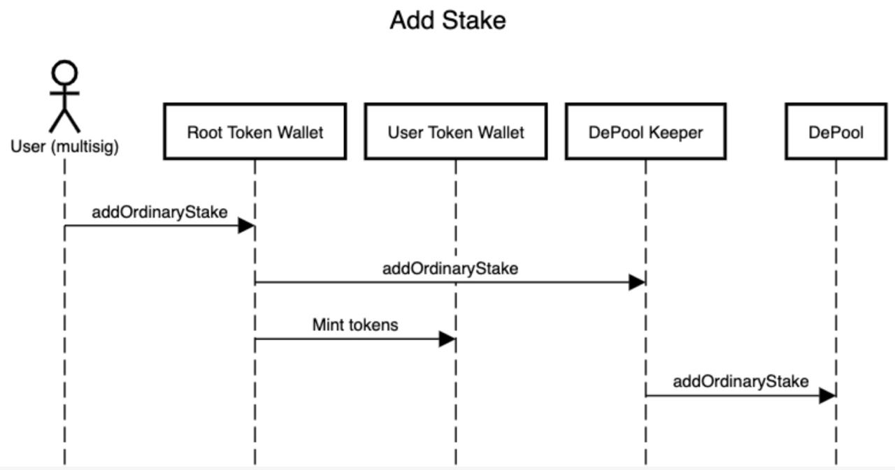
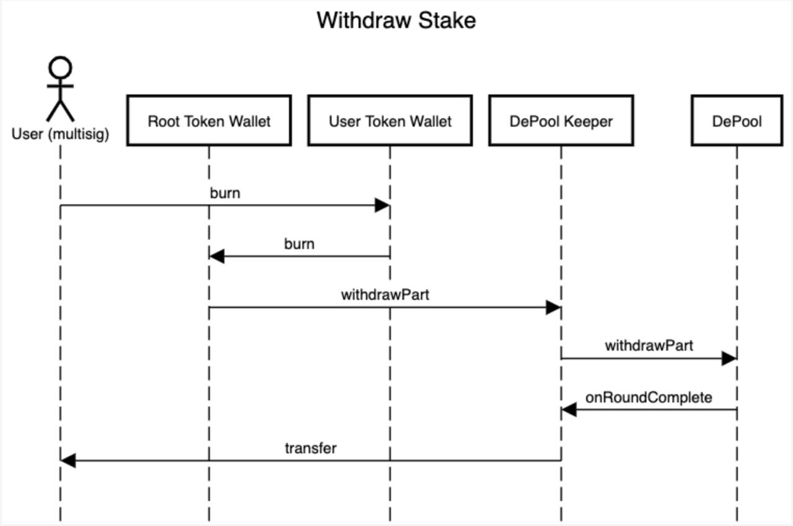

# stTON TIP-3 implementation

`Author`: Anton Platonov

`Telegram`: @SuperArmor

`Wallet Address`: 0:cba39007bdb0f025aac0609b25e96a7d2153f06d22fa47b5f6c26cf756b8b2d6

`[devnet] RTW address`: 0:c123c099c0f1e9720f3c70dd340cde5667f7d28eb283c6ad044662a31830e07e

`[devnet] Fake DePool address`: 0:3071809231f54477f02f084efcbf4d4f365dededc8ce9a708ac3fcb9ade4eca7

`[devnet] DeBot address`: 0:e5c946e108187019cea64b7bdcfb6c1db2ddd0cef9ec59ccb56db2d4ef2de3d3

`Code:` https://github.com/SolderingArmor/stton

## Description

stTON TRC-6 is a custom TRC-6 Token that is minted against transferred TON Crystals; it automatically deposits the Crystals to DePools to gain interest.

Main features of TRC-6 are:

* **Closed Gas Chain** - Gas management is hidden from direct interaction with user. You don’t need to check wallet balance, neither you need to explicitly add any balance to wallets. They. Just. Work. 
* **Cheap Storage** - The size of of both Root and Wallet TVCs do not exceed 3.5Kb. 
* **Notification Payload Control** - TRC-6 has a unique system of triple notifications. Besides a basic event emitting when you receive some tokens, there are also additional mechanisms for both invoker and receiver to receive separate notifications.
* **Guaranteed wallet deployment** - Unlike other Token types *(cough TIP-3)* where you need to manually specify if you want to deploy a target wallet (which can lead to smessage bounces and errors in large message chains if not handled properly) TRC-6 guarantees wallet deployment on any mint and transfer operations, you **never** need to explicitly deploy a wallet (but you can if you desire).

More information may be found here: https://forum.freeton.org/t/tip-6-fungible-tokens-standard/10832

## Implementation

| Feature | Description |
| ----------- | ----------- |
| Create a fungible TIP-3 token contract that will mint stTONs against TONs deposited in a DePool | Done (as per Mitja, https://t.me/freeton_dev_exp/4786, TRC-6 can be considered as TIP-3) |
| Support wrapping all types of stakes for which transfer function is allowed | Only Ordinary stakes implemented because minted tokens are like guarantee of the Crystals that are invested in DePools. Only Ordinary stakes guarantee stake ownership, other types of stakes are needed to transfer ownership. See remarks at the end.* |
| Develop different mechanisms for managing and controlling stTONs, including but not limited to governance tokens, vesting tokens, etc. | Done. TRC-6 management is internal-only (only with addresses, no public keys), it takes the managing out of the scope because management is not a part of TRC-6 and can be changed at any moment (by transferring ownership). TRC-6 Root Owner contract can implement any custom management if needed. |
| Develop a DeBot for management of stTONs (issuance and redeem) | Done |

## Entities

`LiquidFTRoot` - TRC-6 Root Token Wallet that mints tokens when users send TON Crystals to it. Manual minting is disabled, only transfers can trigger mint.

`LiquidFTWallet` - TRC-6 Token Wallet for users.

`DepoolKeeper` - DePool Keeper is a contract that is a `DePool Participant` on Root Wallet's behalf. It is needed to deposit and withdraw stakes. One DePool Keeper represents one DePool. Single Root Wallet can have multiple DePool Keepers.

There are two ways to implement a DePool Keeper:

1. Root Wallet is a DePool Keeper itself; Less code, less contracts, less messages, but every DePool will have their own stTON token, which is not cool at all;
2. (this case) Every Keeper is a separate contract, Root Wallet deploys Keepers and keeps track of them. Distributed contracts approach.

`FakeDepool` - Local fake DePool to test contracts with (no need to wait 54 hours to see if your tests fail).

`SttonDebot` - DeBot for clients to deposit and withdraw their Crystals.

## Depositing a stake

## Withdrawing a stake

## Remarks

### Remark 1: Crystal deposit

Currently when doing a deposit user needs to manually enter DePool address and this DePool needs to be added by Root Token owner beforehand. 

There are several options not to include DePool address in function call (thus making DePools transparent to the user), but these options need discussion to correctly take into account all pros and cons.

### Remark 2: Crystal withdrawal

Currently when a withdrawal operation is performed, `DePool Keeper` calls DePool's `withdrawPart` and user needs to wait up to 54 hours to get his Crystals. This may not be convenient or easily understandable by users.

The other option (not implemented here) is Stake Ownership transfer in DePool. User becomes his part's owner right away and can keep the Crystals in DePool or call withdrawal manually.

Choosing an approach requires a discussion in a room full of smart people.